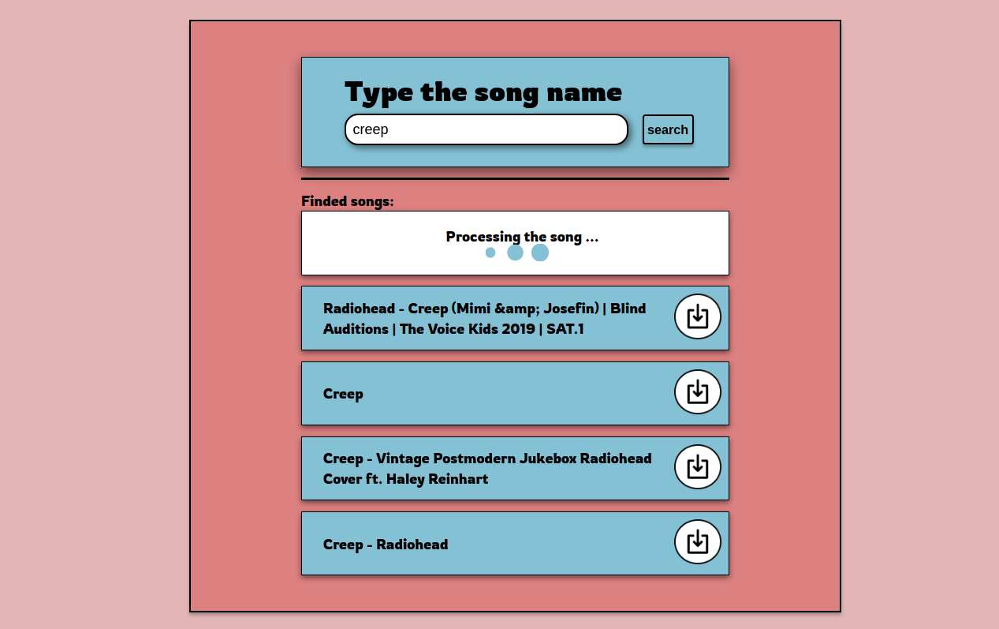

# Requirements

1. Install `youtube-dl`
2. Install `ffmpeg`
3. Install `python`

# Steps

1. Clone project
2. Install dependencies `composer update`
3. Copy `.env.example` and rename it to `.env`
4. Update `.env` accordigly to your settings
5. Generate application key `php artisan key:generate`
6. Run server (for example `php artisan serve`)
7. Run workers `php artisan queue:work`
8. Install front-end packages `npm install`
9. Make link to back end storage
    ```
    mkdir storage/app/public/downloads
    php artisan storage:link
    ```

### Example


